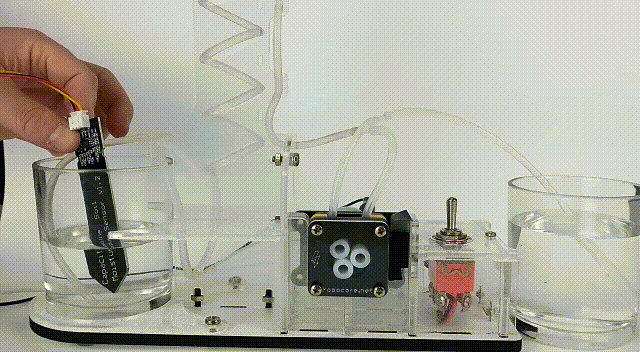
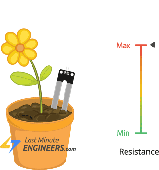

# VII-Oficina-MAKER-IPElab

IMERSÃO PRESENCIAL NO LABORATÓRIO - Sessões de atividades mão-na-massa e prototipagem!
Cinco dias de imersão no mundo maker para desenvolver e prototipar o projeto de um Sistema de Irrigação Automático/Manual com Arduino.

A Oficina Maker IPElab vem com a proposta de apresentar os passos iniciais para a criação e a construção do seu próprio protótipo a partir dos equipamentos disponíveis no nosso laboratório! Para quem possui plantas ou deseja produzir uma pequena horta em casa, trazemos algo que trará um auxílio a pesada rotina que hoje vivenciamos.

Como muitas vezes nos esquecemos de regar as plantas de casa, deixando o seu solo secar, apresentamos uma solução simples como facilitador para essa questão. Neste curso abarcamos no uso do Kit Arduino UNO R3 com o sensor de solo capacitivo para realizar a leitura da umidade do terreno e um motor de passo para simular a inserção da agua ao respectivo ambiente monitorado. Dessa forma, nós vamos organizar o conteúdo da nossa oficina da seguinte maneira:

🗓️ 1º dia:
Recepção dos participantes;
Apresentação do laboratório;
Início da aula expositiva sobre a oficina;

🗓️ 2º dia:
Aula expositiva sobre os processos de prototipagem;
Desenvolvimento com Arduino Uno;

🗓️ 3º dia:
Códigos em C++;

🗓️ 4º dia:
Montagem das peças;
Outros processos de execução;

🗓️ 5º dia:
Testes de validação;
Finalização do projeto

⚠️Pré-requisitos: Possuir noções básicas de programação e vontade de aprender.

## Demo

## Certificado

[Certificado](./img/OFICINA%20MAKER%20-%20Certificado%20de%20Participação%20-%20Daniela%20Fernandes%20do%20Nascimento.pdf)

## Registros 

